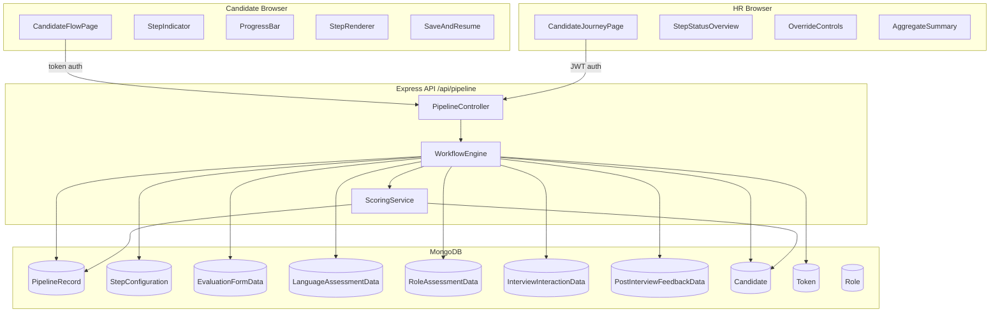
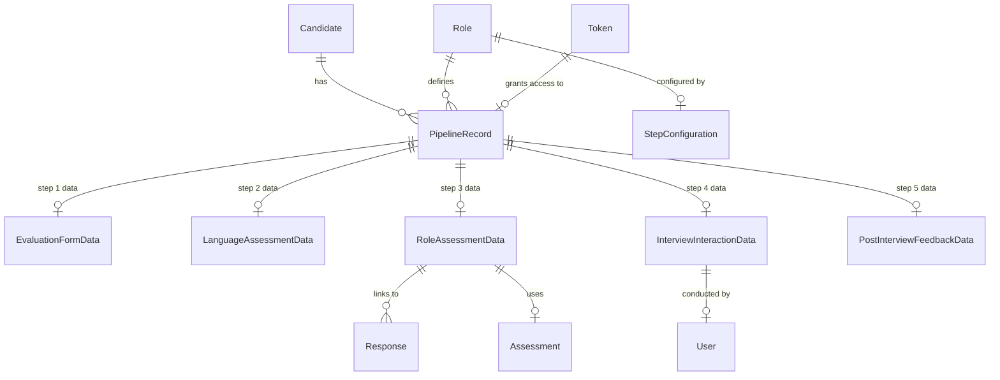

# Design Document: Unified Sequential Candidate Flow (Phase 17)

## Overview

The Unified Sequential Candidate Flow replaces the existing fragmented assessment experience with a single, ordered 5-step evaluation pipeline. A central **WorkflowEngine** service governs step transitions, validation, skip logic, and time-limit enforcement. A **PipelineRecord** document serves as the master tracking record, linking the candidate, role, snapshotted step configuration, and references to each step's dedicated data store.

The five pipeline steps are:

| Order | Step Type | Description |
|-------|-----------|-------------|
| 1 | `EVALUATION_FORM` | Structured candidate profile / screening form |
| 2 | `LANGUAGE_ASSESSMENT` | Written/spoken language proficiency evaluation |
| 3 | `ROLE_BASED_ASSESSMENT` | Technical/aptitude quiz tied to the applied role |
| 4 | `INTERVIEW_INTERACTION` | Structured interview notes and scoring |
| 5 | `POST_INTERVIEW_FEEDBACK` | HR feedback and final recommendation |

Each role can configure which steps are active, their order, whether they are required or optional (skippable), their scoring weight, and their time limit. The pipeline is immutable once started — the role's configuration is snapshotted into the PipelineRecord at creation time.

---

## Architecture



The new `/api/pipeline` route group is registered alongside existing routes in `server.js`. All candidate-facing endpoints authenticate via pipeline token (not HR JWT). All HR-facing endpoints use the existing `protect` + `authorize` middleware.

---

## Components and Interfaces

### Backend Module: `src/modules/pipeline/`

```
pipeline/
  pipeline.controller.js     — Express route handlers
  pipeline.routes.js         — Route definitions
  workflowEngine.service.js  — Core step logic
  scoring.service.js         — Aggregate score computation
  pipeline.model.js          — PipelineRecord schema
  stepConfig.model.js        — StepConfiguration schema
  stepData/
    evaluationForm.model.js
    languageAssessment.model.js
    roleAssessment.model.js
    interviewInteraction.model.js
    postInterviewFeedback.model.js
```

### Frontend Pages and Components

```
pages/candidate/
  PipelineAccessPage.jsx       — Token entry (replaces AccessPage for pipeline flow)
  CandidateFlowPage.jsx        — Main shell: renders StepIndicator + StepRenderer

pages/hr/
  CandidateJourneyPage.jsx     — Full pipeline view for a candidate

components/pipeline/
  StepIndicator.jsx            — "Step N of M" display
  ProgressBar.jsx              — COMPLETED/total ratio bar
  StepRenderer.jsx             — Switches on step type → renders correct form
  SaveResumeControl.jsx        — Save & Resume Later button + auto-save logic
  steps/
    EvaluationFormStep.jsx
    LanguageAssessmentStep.jsx
    RoleAssessmentStep.jsx
    InterviewInteractionStep.jsx
    PostInterviewFeedbackStep.jsx
  hr/
    StepStatusOverview.jsx     — Table of steps with status + timestamps
    OverrideControls.jsx       — Step override form with reason field
    AggregateSummary.jsx       — Completion %, time spent, weighted score
    StepDataViewer.jsx         — Displays raw step data for a selected step
```

### API Endpoints

#### Candidate-Facing (Token Auth via `x-pipeline-token` header)

| Method | Path | Description |
|--------|------|-------------|
| `POST` | `/api/pipeline/session` | Validate token, return PipelineRecord + current step data |
| `PATCH` | `/api/pipeline/:pipelineId/step/save` | Auto-save partial step data (IN_PROGRESS) |
| `POST` | `/api/pipeline/:pipelineId/step/submit` | Submit current step, advance pipeline |
| `POST` | `/api/pipeline/:pipelineId/resume` | Re-enter session, return current step + partial data |

#### HR-Facing (JWT Auth: `protect` + `authorize('admin','hr')`)

| Method | Path | Description |
|--------|------|-------------|
| `POST` | `/api/pipeline/invite` | Create PipelineRecord + Token for a candidate |
| `GET` | `/api/pipeline/:pipelineId` | Get full PipelineRecord with step statuses |
| `GET` | `/api/pipeline/candidate/:candidateId` | Get all pipeline records for a candidate |
| `POST` | `/api/pipeline/:pipelineId/override` | HR override: set current_step |
| `GET` | `/api/pipeline/:pipelineId/step/:stepType/data` | Retrieve step data from Step_Data_Store |
| `GET` | `/api/pipeline/analytics` | Completion rates, avg scores, avg time per role |

#### Step Configuration (JWT Auth: `protect` + `authorize('admin')`)

| Method | Path | Description |
|--------|------|-------------|
| `POST` | `/api/pipeline/config` | Create StepConfiguration for a role |
| `PUT` | `/api/pipeline/config/:roleId` | Update StepConfiguration for a role |
| `GET` | `/api/pipeline/config/:roleId` | Get StepConfiguration for a role |

#### RMS Integration (API Key Auth via `x-rms-api-key` header)

| Method | Path | Description |
|--------|------|-------------|
| `POST` | `/api/pipeline/rms/session` | RMS-initiated session: locate or create PipelineRecord |

---

### Request / Response Shapes

**POST `/api/pipeline/session`**
```json
// Request header: x-pipeline-token: <token_value>
// Response 200
{
  "pipelineId": "...",
  "currentStep": "EVALUATION_FORM",
  "stepStatus": { "EVALUATION_FORM": "IN_PROGRESS", ... },
  "completedSteps": [],
  "partialData": { ... },
  "stepConfig": { "timeLimit": 30, "required": true }
}
```

**POST `/api/pipeline/:pipelineId/step/submit`**
```json
// Request body
{ "stepType": "EVALUATION_FORM", "data": { "yearsExperience": 3, ... } }
// Response 200
{ "advanced": true, "nextStep": "LANGUAGE_ASSESSMENT", "pipelineStatus": "IN_PROGRESS" }
// Response 422 (missing fields)
{ "error": "VALIDATION_FAILED", "missingFields": ["yearsExperience"] }
```

**POST `/api/pipeline/:pipelineId/override`**
```json
// Request body
{ "targetStep": "ROLE_BASED_ASSESSMENT", "reason": "Candidate rescheduled language step" }
// Response 200
{ "previousStep": "LANGUAGE_ASSESSMENT", "currentStep": "ROLE_BASED_ASSESSMENT" }
// Response 422 (empty reason)
{ "error": "REASON_REQUIRED" }
```

---

## Data Models

### PipelineRecord

```javascript
// src/modules/pipeline/pipeline.model.js
const stepStatusSchema = new mongoose.Schema({
  status: {
    type: String,
    enum: ['NOT_STARTED', 'IN_PROGRESS', 'COMPLETED', 'SKIPPED'],
    default: 'NOT_STARTED',
  },
  startedAt:   { type: Date, default: null },
  completedAt: { type: Date, default: null },
  dataRef:     { type: mongoose.Schema.Types.ObjectId, default: null }, // ref to Step_Data_Store doc
  score:       { type: Number, default: null },
}, { _id: false });

const pipelineRecordSchema = new mongoose.Schema({
  candidateId:    { type: mongoose.Schema.Types.ObjectId, ref: 'Candidate', required: true },
  roleId:         { type: mongoose.Schema.Types.ObjectId, ref: 'Role', required: true },
  tokenId:        { type: mongoose.Schema.Types.ObjectId, ref: 'Token' },

  // Snapshotted at creation — immune to role config changes
  stepConfigSnapshot: [stepConfigEntrySchema],

  currentStep: {
    type: String,
    enum: ['EVALUATION_FORM','LANGUAGE_ASSESSMENT','ROLE_BASED_ASSESSMENT',
           'INTERVIEW_INTERACTION','POST_INTERVIEW_FEEDBACK'],
  },
  completedSteps: [{ type: String }],

  stepStatus: {
    EVALUATION_FORM:       { type: stepStatusSchema, default: () => ({}) },
    LANGUAGE_ASSESSMENT:   { type: stepStatusSchema, default: () => ({}) },
    ROLE_BASED_ASSESSMENT: { type: stepStatusSchema, default: () => ({}) },
    INTERVIEW_INTERACTION: { type: stepStatusSchema, default: () => ({}) },
    POST_INTERVIEW_FEEDBACK: { type: stepStatusSchema, default: () => ({}) },
  },

  status: {
    type: String,
    enum: ['IN_PROGRESS', 'FINISHED', 'EXPIRED'],
    default: 'IN_PROGRESS',
  },

  aggregateScore:      { type: Number, default: null },
  totalTimeSpentSecs:  { type: Number, default: 0 },
}, { timestamps: true });

// Unique constraint: one active pipeline per candidate+role
pipelineRecordSchema.index({ candidateId: 1, roleId: 1 }, { unique: true });
```

### StepConfiguration

```javascript
// src/modules/pipeline/stepConfig.model.js
const stepConfigEntrySchema = new mongoose.Schema({
  stepType: {
    type: String,
    enum: ['EVALUATION_FORM','LANGUAGE_ASSESSMENT','ROLE_BASED_ASSESSMENT',
           'INTERVIEW_INTERACTION','POST_INTERVIEW_FEEDBACK'],
    required: true,
  },
  order:         { type: Number, required: true },
  required:      { type: Boolean, default: true },
  skip:          { type: Boolean, default: false }, // auto-skip if optional
  scoringWeight: { type: Number, default: 0 },      // must sum to 100 across all steps
  timeLimitMins: { type: Number, default: null },   // null = no limit
}, { _id: false });

const stepConfigurationSchema = new mongoose.Schema({
  roleId: { type: mongoose.Schema.Types.ObjectId, ref: 'Role', required: true, unique: true },
  steps:  [stepConfigEntrySchema],
  createdBy: { type: mongoose.Schema.Types.ObjectId, ref: 'User' },
}, { timestamps: true });
```

### Token Model Extension

The existing `Token` model gains an optional `pipelineId` field:

```javascript
// Added to existing tokenSchema
pipelineId: { type: mongoose.Schema.Types.ObjectId, ref: 'PipelineRecord', default: null },
```

The `assessmentId` field becomes optional (`required: false`) to support pipeline-only tokens.

### Step Data Store Models

All five share the same base shape plus step-specific payload:

```javascript
// Base fields shared by all Step_Data_Store models
{
  candidateId:  { type: ObjectId, ref: 'Candidate', required: true },
  pipelineId:   { type: ObjectId, ref: 'PipelineRecord', required: true },
  stepType:     { type: String, enum: [...], required: true },
  status:       { type: String, enum: ['IN_PROGRESS','COMPLETED'], default: 'IN_PROGRESS' },
  startedAt:    { type: Date },
  submittedAt:  { type: Date, default: null },
  timeSpentSecs:{ type: Number, default: 0 },
}
```

**EvaluationFormData** — additional fields:
```javascript
{
  yearsExperience:    Number,
  currentTitle:       String,
  noticePeriodDays:   Number,
  salaryExpectation:  Number,
  availableFrom:      Date,
  linkedinUrl:        String,
  portfolioUrl:       String,
  answers:            [{ questionId: String, answer: String }], // custom screening Qs
}
```

**LanguageAssessmentData** — additional fields:
```javascript
{
  language:           String,   // e.g. "English"
  writtenScore:       Number,
  spokenScore:        Number,
  grammarScore:       Number,
  overallBand:        String,   // e.g. "B2"
  responses:          [{ prompt: String, response: String, score: Number }],
}
```

**RoleAssessmentData** — additional fields:
```javascript
{
  assessmentId:       { type: ObjectId, ref: 'Assessment' }, // links to existing Assessment
  responses:          [{ type: ObjectId, ref: 'Response' }], // links to existing Response docs
  sectionScores:      { aptitude: Number, technical: Number, reasoning: Number, communication: Number },
  autoScore:          Number,
  completionRate:     Number,
}
```

**InterviewInteractionData** — additional fields:
```javascript
{
  interviewerId:      { type: ObjectId, ref: 'User' },
  scheduledAt:        Date,
  conductedAt:        Date,
  durationMins:       Number,
  questions:          [{ question: String, response: String, score: Number, notes: String }],
  overallInterviewScore: Number,
  interviewerNotes:   String,
}
```

**PostInterviewFeedbackData** — additional fields:
```javascript
{
  submittedBy:        { type: ObjectId, ref: 'User' },
  recommendation:     { type: String, enum: ['excellent','strong','moderate','needs_review','reject'] },
  strengths:          [String],
  concerns:           [String],
  finalNotes:         String,
  hrScore:            Number,
}
```

---

## Workflow Engine Logic

### Step Advancement Algorithm

```
function advanceStep(pipeline, submittedStepType, submittedData):
  1. Validate submittedData against required fields for submittedStepType
     → if invalid: return VALIDATION_FAILED + missingFields[]
  2. Persist submittedData to Step_Data_Store (status = COMPLETED)
  3. Update pipeline.stepStatus[submittedStepType]:
       status = COMPLETED, completedAt = now, dataRef = new doc _id
  4. Add submittedStepType to pipeline.completedSteps
  5. Compute nextStep = next entry in stepConfigSnapshot by order
  6. WHILE nextStep exists AND nextStep.skip == true AND nextStep.required == false:
       pipeline.stepStatus[nextStep.stepType].status = SKIPPED
       nextStep = next entry after nextStep
  7. IF nextStep exists:
       pipeline.currentStep = nextStep.stepType
       pipeline.stepStatus[nextStep.stepType].startedAt = now
       pipeline.stepStatus[nextStep.stepType].status = IN_PROGRESS
  8. ELSE (no more steps):
       pipeline.status = FINISHED
       pipeline.currentStep = null
       Candidate.assessmentStatus = 'completed'
       trigger computeAggregateScore(pipeline)
  9. Save pipeline
  10. Return { advanced, nextStep, pipelineStatus }
```

### Skip Logic

A step is auto-skipped when `stepConfigSnapshot` entry has `skip: true` AND `required: false`. The engine loops through consecutive skippable steps before landing on the next active step or finishing the pipeline.

### Time Limit Enforcement

When a step with `timeLimitMins` is started, `stepStatus[stepType].startedAt` is recorded. On each `/step/save` and `/step/submit` call, the engine checks:

```
elapsed = now - startedAt (in minutes)
if elapsed >= timeLimitMins:
  auto-submit with current partial data
  mark step COMPLETED (or COMPLETED with partial flag)
  advance pipeline
```

On resume, remaining time is returned to the frontend:
```
remainingMins = timeLimitMins - floor((now - startedAt) / 60000)
```

### HR Override Algorithm

```
function hrOverride(pipeline, targetStep, hrUserId, reason):
  1. Validate reason is non-empty and non-whitespace → reject if empty
  2. previousStep = pipeline.currentStep
  3. IF pipeline.stepStatus[targetStep].status == COMPLETED:
       pipeline.stepStatus[targetStep].status = NOT_STARTED
       pipeline.stepStatus[targetStep].completedAt = null
       remove targetStep from pipeline.completedSteps
  4. pipeline.currentStep = targetStep
  5. pipeline.stepStatus[targetStep].status = IN_PROGRESS
  6. Append to Candidate.timeline:
       { event: 'hr_override', performedBy: hrUserId,
         description: `Override from ${previousStep} to ${targetStep}: ${reason}` }
  7. Save pipeline + candidate
  8. Return { previousStep, currentStep: targetStep }
```

### Pipeline Record Idempotency

Before creating a new PipelineRecord, the engine queries `{ candidateId, roleId }`. If a record exists, it is returned as-is. The unique compound index on `(candidateId, roleId)` enforces this at the database level.

---

## Integration Points with Existing Models



- **Candidate**: `assessmentStatus` and `overallScore` are updated by the WorkflowEngine when the pipeline finishes. `timeline[]` receives `session_started` and `hr_override` events.
- **Token**: Extended with `pipelineId`. `assessmentId` becomes optional. Token validation logic in `token.controller.js` is extended to resolve the linked PipelineRecord.
- **Role**: `StepConfiguration` is a separate document keyed by `roleId`. The Role model itself is not modified.
- **Assessment / Response**: `RoleAssessmentData` links to the existing `Assessment` and `Response` collections, reusing the existing assessment runner flow for step 3.
- **Score**: The existing `Score` model is not used for pipeline aggregate scoring. Aggregate scores live in `PipelineRecord.aggregateScore` and per-step scores in `stepStatus[type].score`.

---

## Aggregate Scoring Design

### Weighted Score Computation

```
aggregateScore = Σ (stepScore_i × weight_i) / 100

where:
  stepScore_i  = pipeline.stepStatus[stepType].score  (0–100)
  weight_i     = stepConfigSnapshot[stepType].scoringWeight
  sum(weight_i) = 100  (enforced at StepConfiguration save time)
  SKIPPED steps contribute 0 to the numerator and their weight is redistributed
```

### Weight Redistribution for Skipped Steps

When steps are skipped, their weight is redistributed proportionally among completed steps:

```
activeSteps = steps where status != SKIPPED
totalActiveWeight = sum(activeSteps.scoringWeight)
effectiveWeight_i = (step_i.scoringWeight / totalActiveWeight) * 100
aggregateScore = Σ (stepScore_i × effectiveWeight_i) / 100
```

### Score Update Trigger

The `computeAggregateScore` function is called:
1. When the pipeline reaches `FINISHED` status.
2. When any `stepStatus[type].score` is updated after initial computation (e.g., interviewer updates their score).

After computation, both `PipelineRecord.aggregateScore` and `Candidate.overallScore` are updated atomically.

---

## Error Handling

| Scenario | HTTP Status | Error Code | Description |
|----------|-------------|------------|-------------|
| Invalid/expired token | 401 | `TOKEN_INVALID` | Token not found, expired, or already consumed |
| Pipeline not found | 404 | `PIPELINE_NOT_FOUND` | No PipelineRecord for given ID |
| Step validation failure | 422 | `VALIDATION_FAILED` | Missing required fields; includes `missingFields[]` |
| Weights don't sum to 100 | 422 | `WEIGHT_SUM_INVALID` | StepConfiguration rejected |
| Override with empty reason | 422 | `REASON_REQUIRED` | HR override rejected |
| Duplicate pipeline creation | 200 | — | Returns existing record (idempotent, not an error) |
| Time limit exceeded | 200 | `TIME_LIMIT_EXCEEDED` | Step auto-submitted; pipeline advanced |
| Unauthorized HR action | 403 | `ACCESS_DENIED` | User lacks required role |

All errors follow the existing `errorHandler` middleware shape: `{ message, code?, details? }`.

---

## Testing Strategy

### Unit Tests (example-based)

- WorkflowEngine: step advancement with valid data, skip logic chains, time limit calculation
- ScoringService: weight redistribution for skipped steps, recomputation on score update
- Token validation: expired token rejection, consumed token rejection
- HR override: empty reason rejection, completed step reset

### Property-Based Tests

The project uses **fast-check** (JavaScript PBT library) with a minimum of **100 iterations per property**.

Each property test is tagged:
`// Feature: unified-candidate-flow, Property N: <property_text>`

### Integration Tests

- RMS session initiation (mock RMS request → pipeline located/created)
- Analytics endpoint with seeded pipeline data
- Full pipeline run: token → session → 5 step submissions → FINISHED


---

## Correctness Properties

*A property is a characteristic or behavior that should hold true across all valid executions of a system—essentially, a formal statement about what the system should do. Properties serve as the bridge between human-readable specifications and machine-verifiable correctness guarantees.*

After reviewing the prework analysis, several properties were identified as redundant or subsumable. The following consolidated properties provide comprehensive coverage without duplication:

### Property 1: Pipeline Record Creation Invariants

*For any* candidate and role with a valid StepConfiguration, when a PipelineRecord is created, the record SHALL contain:
- A reference to the candidateId (not embedded profile data)
- A snapshotted copy of the role's StepConfiguration
- `current_step` set to the first step in the configuration
- `completed_steps` initialized as an empty array
- `step_status` map with all configured steps initialized to `NOT_STARTED`

**Validates: Requirements 1.1, 1.2, 1.3**

---

### Property 2: Pipeline Record Idempotency

*For any* candidate and role combination, calling the pipeline creation function multiple times SHALL return the same PipelineRecord instance without creating duplicate documents, and the count of PipelineRecords for that (candidateId, roleId) pair SHALL remain 1.

**Validates: Requirements 1.4**

---

### Property 3: Token Authentication and Session Initialization

*For any* valid, unexpired, and unconsumed Token, authentication SHALL return the correct PipelineRecord and append a `session_started` event to the candidate's timeline.

**Validates: Requirements 2.1, 2.4**

---

### Property 4: Invalid Token Rejection

*For any* Token where `expiresAt` is in the past OR `isUsed` is true OR `useCount >= maxUses`, authentication SHALL reject the session and return a descriptive error message.

**Validates: Requirements 2.2**

---

### Property 5: Step Renderer Mapping

*For any* step type in the enum `['EVALUATION_FORM', 'LANGUAGE_ASSESSMENT', 'ROLE_BASED_ASSESSMENT', 'INTERVIEW_INTERACTION', 'POST_INTERVIEW_FEEDBACK']`, the StepRenderer component SHALL return the correct corresponding step component.

**Validates: Requirements 3.1**

---

### Property 6: Step Indicator Display

*For any* PipelineRecord with N total configured steps and current_step at position K (1-indexed), the step indicator SHALL display "Step K of N".

**Validates: Requirements 3.2**

---

### Property 7: Progress Bar Computation

*For any* PipelineRecord with a step_status map, the progress bar value SHALL equal `count(steps where status == 'COMPLETED') / total_steps`.

**Validates: Requirements 3.3**

---

### Property 8: Step Submission Validation

*For any* step submission missing at least one required field, the WorkflowEngine SHALL reject the submission, return a validation error listing the missing fields, and NOT mark the step as `COMPLETED` or advance the pipeline.

**Validates: Requirements 4.1, 4.2**

---

### Property 9: Step Completion and Advancement

*For any* PipelineRecord at any non-final step, when a valid step submission is processed, the WorkflowEngine SHALL:
- Update `completed_steps` to include the submitted step
- Set `step_status[submittedStep]` to `COMPLETED`
- Advance `current_step` to the next configured step

**Validates: Requirements 4.3**

---

### Property 10: Auto-Skip Logic

*For any* PipelineRecord where the next step in the configuration has `skip: true` AND `required: false`, the WorkflowEngine SHALL automatically set that step's `step_status` to `SKIPPED` and advance `current_step` to the following step without requiring candidate interaction.

**Validates: Requirements 4.4**

---

### Property 11: Pipeline Completion

*For any* PipelineRecord where all configured steps have `step_status` of either `COMPLETED` or `SKIPPED`, the WorkflowEngine SHALL:
- Set `PipelineRecord.status` to `FINISHED`
- Set `Candidate.assessmentStatus` to `'completed'`
- Trigger aggregate score computation

**Validates: Requirements 4.5**

---

### Property 12: Step Configuration Weight Validation

*For any* array of step configuration entries with scoring weights, the validation SHALL pass if and only if the sum of all `scoringWeight` values equals 100.

**Validates: Requirements 5.2, 5.3**

---

### Property 13: Step Configuration Snapshot Immutability

*For any* PipelineRecord created from a Role's StepConfiguration, subsequent modifications to the Role's StepConfiguration SHALL NOT affect the PipelineRecord's snapshotted configuration.

**Validates: Requirements 5.4**

---

### Property 14: Time Limit Enforcement

*For any* step with a configured `timeLimitMins` value T, when elapsed time since `startedAt` reaches or exceeds T minutes, the WorkflowEngine SHALL automatically submit the step with current partial data and advance the pipeline.

**Validates: Requirements 5.5**

---

### Property 15: Step Data Routing

*For any* step submission of type X, the WorkflowEngine SHALL persist the submission data to the correct Step_Data_Store collection corresponding to X, with correct `candidateId` and `pipelineId` references, and SHALL update the PipelineRecord's `stepStatus[X].dataRef` to point to the new document.

**Validates: Requirements 6.1, 6.2, 6.3, 6.4, 6.5, 6.6**

---

### Property 16: Partial Data Persistence

*For any* partial step submission (session ended without completion), the WorkflowEngine SHALL persist the partial data to the Step_Data_Store with `status: 'IN_PROGRESS'` and retain the PipelineRecord's `step_status[stepType].status` as `IN_PROGRESS`.

**Validates: Requirements 7.1**

---

### Property 17: Session Resume Round-Trip

*For any* PipelineRecord with partial step data saved, when a candidate re-authenticates with a valid Token, the system SHALL restore the candidate to their `current_step` and pre-populate the step form with the previously saved partial data.

**Validates: Requirements 7.2**

---

### Property 18: Remaining Time Calculation

*For any* step with `timeLimitMins` T and elapsed time E (in minutes) where E < T, when a candidate resumes the session, the WorkflowEngine SHALL return `remainingTime = T - E`.

**Validates: Requirements 7.4**

---

### Property 19: HR Journey View Rendering

*For any* PipelineRecord, the HR journey view SHALL display all configured steps with their corresponding `step_status`, `startedAt`, and `completedAt` timestamps.

**Validates: Requirements 8.1**

---

### Property 20: Aggregate Summary Computation

*For any* PipelineRecord, the aggregate summary SHALL compute:
- `completionPercentage = count(COMPLETED steps) / total_steps * 100`
- `totalTimeSpent = sum(stepStatus[*].timeSpentSecs)`
- `weightedScore = sum(stepStatus[i].score * stepConfigSnapshot[i].scoringWeight) / 100` (with weight redistribution for skipped steps)

**Validates: Requirements 8.3**

---

### Property 21: HR Override State Update

*For any* PipelineRecord and any valid target step, when an authorized HR user submits an override request with a non-empty reason, the WorkflowEngine SHALL:
- Update `current_step` to the target step
- Append an `hr_override` event to the candidate's timeline with `userId`, `previousStep`, `newStep`, and `reason`

**Validates: Requirements 9.1, 9.2**

---

### Property 22: HR Override Reason Validation

*For any* override request where the `reason` field is empty or contains only whitespace characters, the WorkflowEngine SHALL reject the request and return a validation error.

**Validates: Requirements 9.3**

---

### Property 23: HR Override Step Reset

*For any* PipelineRecord where an HR override targets a step with `step_status == 'COMPLETED'`, the WorkflowEngine SHALL:
- Reset that step's `step_status` to `NOT_STARTED`
- Set `completedAt` to null
- Remove the step from `completed_steps`

**Validates: Requirements 9.4**

---

### Property 24: Weighted Aggregate Score Computation

*For any* set of step scores and weights where the sum of weights equals 100, the aggregate score SHALL equal `sum(score_i * weight_i) / 100`, and both `PipelineRecord.aggregateScore` and `Candidate.overallScore` SHALL be updated with this value.

**Validates: Requirements 10.1, 10.2**

---

### Property 25: Score Recomputation on Update

*For any* PipelineRecord with a previously computed aggregate score, when any `stepStatus[type].score` is updated, the WorkflowEngine SHALL recompute the aggregate score using the new step score value and update both `PipelineRecord.aggregateScore` and `Candidate.overallScore`.

**Validates: Requirements 10.3**

---

## Property-Based Test Configuration

All property-based tests SHALL:
- Use the **fast-check** library for JavaScript
- Run a minimum of **100 iterations** per property
- Include a comment tag in the format: `// Feature: unified-candidate-flow, Property N: <property_text>`
- Generate random valid inputs appropriate to the property being tested
- Use appropriate generators for MongoDB ObjectIds, dates, enums, and nested structures

Example test structure:
```javascript
// Feature: unified-candidate-flow, Property 1: Pipeline Record Creation Invariants
test('Pipeline creation initializes all required fields correctly', () => {
  fc.assert(
    fc.property(
      candidateIdArb,
      roleIdArb,
      stepConfigArb,
      (candidateId, roleId, stepConfig) => {
        const pipeline = createPipelineRecord(candidateId, roleId, stepConfig);
        expect(pipeline.candidateId).toEqual(candidateId);
        expect(pipeline.current_step).toEqual(stepConfig[0].stepType);
        expect(pipeline.completed_steps).toEqual([]);
        // ... additional assertions
      }
    ),
    { numRuns: 100 }
  );
});
```

